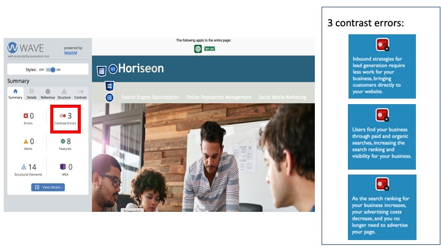
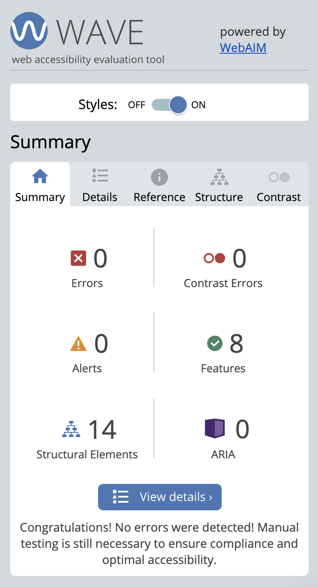

## Motivation

Accessbility of a website is of paramount importance to a responsible and reputable business. It not only ensures smooth user experience, but enpowers acquisition of web information by the visually impaired. Moreover, improving web accessibility also boosts SEO of a business, augmenting its exposure to potential customers.

As a web developer, the act of maintaining and improving the codebase is an integral part of business operations. The act sustains the reputation of a business and strengthens the business relationship with its clients.

Here, a website that belongs to Horiseon Marketing Agency requires code-refatoring. The aim is to perfect its overall accessibilty to meet user story, following the current standards in HTML/CSS and best practices in version control and website deployment.

## User Story

Client requests that a codebase should meet accessibility standards which in turn optimises SEO.

## Acceptance criteria:

1. Semantic HTML elements
2. Logical structure of HTML elements
3. Image element in consideration of image unable to upload and/or the visually impaired
4. Headings should be in correct sequence
5. Concise and descriptive title

## Project aims

- Meet acceptance criteria as mentioned above:

  - correct and functional links
  - clean and concise CSS selectors and properties
  - commenting on CSS code where necessary

- Follow good practice of deployment:

  - project deployed with live URL presented
  - no errors upon application upload
  - Github URL provided along with code in the project repository

- Application quality:

  - The application should resemble the mockup (link mockup.jpg in assets).

- Repository quality:

  - unique repository name
  - best practices for file structure and naming convention
  - best practices for class/id naming conventions, indentation
  - quality comments
  - descriptive commits
  - quality README file including the description, screenshot and link to deployed application.

## test

Chrome extension WAVE is used to test the web accessibility. There are no major errors, but there are 3 contrast erros, originating from the sidebar.  These errors are corrected accrodingly, resulting in an error-free page. 

## usage: deployed link and how to clone the final result

## Installation
